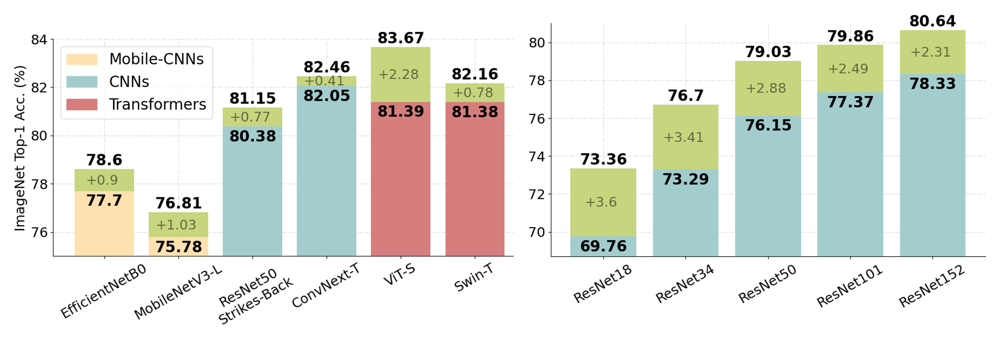

# TransBoost - a Simple Method for Improving Classification Performance through Deep Transductive Learning

This repository contains the official implementation of our paper: [TransBoost: Improving the Best ImageNet Performance using Deep Transduction](https://arxiv.org/abs/2205.13331) (NeurIPS 2022).

**TLDR**:
We deal with *deep transductive learning*, and propose *TransBoost* as a procedure for fine-tuning any deep neural model to improve its performance on any (unlabeled) test set provided at training time. TransBoost is inspired by a large margin principle and is efficient and simple to use.
Our method significantly improves the ImageNet classification performance on a wide range of architectures, such as ResNets, MobileNetV3-L, EfficientNetB0, ViT-S, and ConvNext-T, leading to state-of-the-art transductive performance.
Additionally we show that TransBoost is effective on a wide variety of image classification datasets.

## Citation

If you find our paper/code helpful, please cite our paper:

    @article{belhasin2022transboost,
        title={TransBoost: Improving the Best ImageNet Performance using Deep Transduction},
        author={Belhasin, Omer and Bar-Shalom, Guy and El-Yaniv, Ran},
        journal={arXiv preprint arXiv:2205.13331},
        year={2022}
    }

## Results

This code is designed to reproduce our results of the experiments on **ResNets** variants in **ImageNet**.

| Architecture | Params (M) | Inductive (standard) (%) | Transductive (ours) (%) | Improvement (%) |
|--------------|------------|--------------------------|-------------------------|-----------------|
| ResNet18     | 11.69      | 69.76                    | 73.36                   | +3.60           |
| ResNet34     | 21.80      | 73.29                    | 76.70                   | +3.41           |
| ResNet50     | 25.56      | 76.15                    | 79.03                   | +2.88           |
| ResNet101    | 44.55      | 77.37                    | 79.86                   | +2.49           |
| ResNet152    | 60.19      | 78.33                    | 80.64                   | +2.31           |

## Usage

Make sure you have downloaded the **ImageNet** dataset first.

To clone and install this repository run the following commands:

    git clone https://github.com/omerb01/TransBoost.git
    cd TransBoost
    pip install -r requirements.txt

To run TransBoost (train & test):

    usage: transboost.py [-h] [--dev DEV] --gpus GPUS [--resume RESUME] --data-dir DATA_DIR [--num-workers NUM_WORKERS] [--wandb]
                     [--gpu-monitor] [--data DATA] --model MODEL [--seed SEED] [--max-epochs MAX_EPOCHS]
                     [--batch-size BATCH_SIZE] [--optimizer OPTIMIZER] [--learning-rate LEARNING_RATE] [--cosine]
                     [--weight-decay WEIGHT_DECAY] [--lamda LAMDA] [--test-only]

    optional arguments:
      -h, --help            show this help message and exit
      --dev DEV             debugging mode
      --gpus GPUS           number of gpus
      --resume RESUME       path
      --data-dir DATA_DIR   data dir
      --num-workers NUM_WORKERS
                            number of cpus per gpu
      --wandb               logging in wandb
      --gpu-monitor         monitors gpus. Note: slowing the training process
      --data DATA           dataset name
      --model MODEL         model name
      --seed SEED           seed
      --max-epochs MAX_EPOCHS
                            number of fine-tuning epochs
      --batch-size BATCH_SIZE
                            batchsize for each gpu, for each train/test. i.e.: actual batchsize = 128 x num_gpus x 2
      --optimizer OPTIMIZER
      --learning-rate LEARNING_RATE
      --cosine              apply cosine annealing lr scheduler
      --weight-decay WEIGHT_DECAY
      --lamda LAMDA         TransBoost loss hyperparameter
      --test-only           run testing only

For example, to reproduce our result on **ResNet50** in **ImageNet**, run:

    python transboost.py --gpus 4 --data-dir /path-to-data-folder/ImageNet --model resnet50

## Acknowledgments

This research was partially supported by the Israel Science Foundation, grant No. 710/18.
